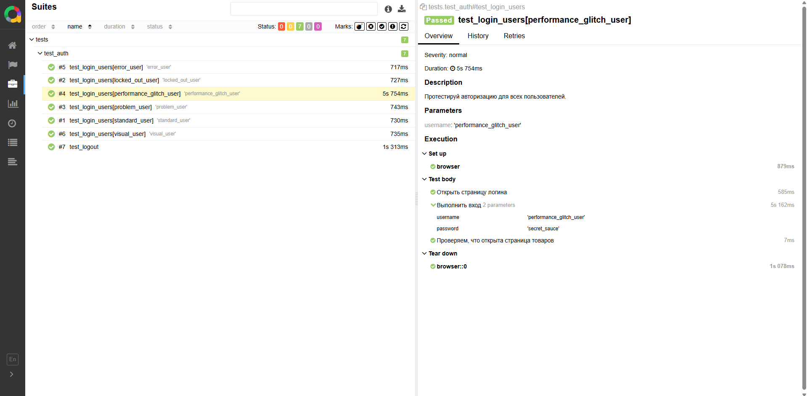

# Demo-Tests: Pytest + Selenium + Allure

Автоматизированные тесты для демо-приложения на Python с использованием Selenium, Pytest и Allure.

---

## 📦 Установка окружения

1. Клонируем репозиторий:

```bash
git clone <URL вашего репозитория>
cd demo-tests
```

2. Создаем виртуальное окружение и активируем его:

```powershell
python -m venv venv
.\venv\Scripts\Activate.ps1   # PowerShell
# .\venv\Scripts\activate.bat # CMD
```

3. Устанавливаем зависимости:

```bash
pip install -r requirements.txt
```

Если `requirements.txt` нет, вручную:

```bash
pip install pytest selenium allure-pytest
pip install mypy ruff types-requests types-selenium
```

---

## 🚀 Запуск тестов

- Запуск всех тестов:

```bash
pytest --browser=chrome
```

- Запуск с указанием версии браузера и генерацией Allure-отчета:

```bash
pytest --browser=chrome --browser-version=121.0 --alluredir=allure-results
```

> Параметры `--browser` и `--browser-version` настроены в `conftest.py`.

---

## 📊 Allure-отчет

1. Устанавливаем Allure CLI:  
[https://docs.qameta.io/allure/#_get_started](https://docs.qameta.io/allure/#_get_started)

2. Генерируем и открываем отчет:

```bash
allure serve allure-results
```

3. Скриншоты при падении теста автоматически сохраняются через фикстуру `pytest_runtest_makereport`.

---

## 🌐 Настройка браузеров

В `conftest.py`:

```python
if browser_name == "chrome":
    options = webdriver.ChromeOptions()
    driver = webdriver.Chrome(options=options)
elif browser_name == "firefox":
    options = webdriver.FirefoxOptions()
    driver = webdriver.Firefox(options=options)
```

Можно добавлять опции браузера:

```python
options.add_argument("--headless")  # Запуск без GUI
options.add_argument("--window-size=1920,1080")
```

---

## ✅ Проверка типов и стиля

- Mypy — проверка типов:

```bash
mypy .
```

- Ruff — проверка стиля и линтинг:

```bash
ruff check .
ruff check . --fix   # автоисправление
```

---

## 🤛 Пример теста

```python
def test_login(browser: WebDriver):
    browser.get("https://www.saucedemo.com")
    login_page = LoginPage(browser)
    login_page.login("standard_user", "secret_sauce")
    assert browser.current_url.endswith("/inventory.html")
```

Фикстура `browser` автоматически управляет запуском и закрытием драйвера.

---

## 🖼️ Скриншот

